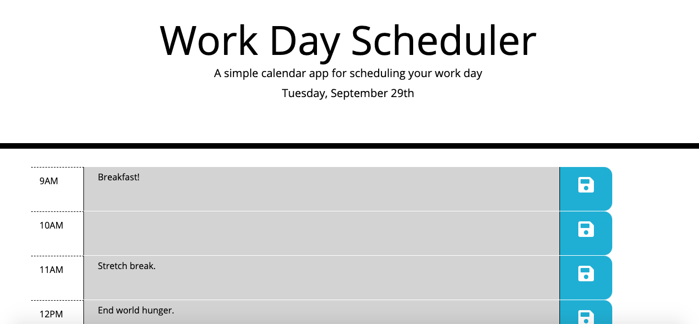

# workday-planner

Homework for Week 5

[LINK TO PAGE](linkhere)

index.html

## Approach & Process

- Looked at the provided CSS and HTML to see what types of containers each hour would be in
- Added the relevant CSS classes to the HTML to understand the relationship between the two, and to start planning JS
- Looked up moment.js to get a handle of it and played around with creating time variables with different details
- Created two time variables: NOW (which determined when to add/remove the past/present/future classes) and today (which went underneath the name of the planner)
- Created the task variable, and attached the tool for it to be parsed and put into local storage (but only if there was any text, hence the double pipes and empty curly braces)
- Created a variable that held a string of all the IDs of each time's text block
- Used a for loop to iterate through the string of times to determine if the time of NOW (set by the hour) was either less than (future), more than (past), or else (equal to, meaning, present) it, and then removed classes based on that. I'm only removing classes since each element has all three classes (past present future), so I would just have to remove the ones that don't pertain to that column.
- Button time! I created an on-click event for the "saveBtn" class. Within that, I needed two variables: userInput (which collects, using "this," the textarea of the selected column) and timeID (which selects the time ID of the selected column). This way, when both are saved, I don't have to create a separate key for each column's textarea value.
- Inserted the userInput into the task array that also has the timeID, and put that (with the task stringified) into local storage
- FINALLY, created a for loop using property to call back the local storage, to put it back in the text area when the screen is refreshed.

## Discoveries

- Template/String literals! My tutor taught this to me, and I had someone explain it in office hours to make sure that I understood it. Basically, this is an easier way to write a string and plug variables in-- they fill automatically, so you don't have to use string concatenation or list, in this case id=10, id=9, etc.
- property in a template literal was a bit of a mind melt at first, but this is used to put the locally stored information back into the relative text areas-- it does this by reading the timeID first, and then adding the corresponding text area. Magic!

## Further features for next time

- A "completed" strikethrough button next to the "save" button (since that's the best part of a to-do list-- crossing it off!)
- An option to color-code parts of the calendar for different types of tasks
- Option to split up each our into 15-minute blocks (maybe as separate columns)
